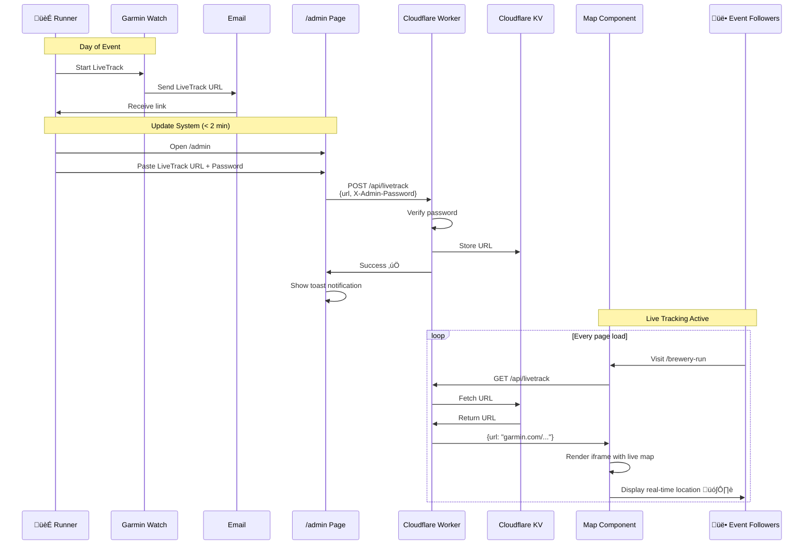

# MRC Baltic Cruise 2025 mobile program

[](https://app.netlify.com/sites/mrcbalticcruise/deploys)
[](https://github.com/Tiketti/mrc-baltic-cruise/actions/workflows/playwright.yml)

This project contains multiple MRC event sites:

- **Root (/)**: Landing page with links to all events
- **Baltic Cruise (/baltic-cruise)**: Archived 2025 Baltic Cruise site  
- **Brewery Run (/brewery-run)**: Helsinki brewery-to-brewery running event

## Brewery Run Features

The brewery run site includes:
- **Real-time timeline**: Shows current brewery location and running status
- **Smart highlighting**: Visual indicators based on current time
- **Mobile-first design**: Optimized for use during the event
- **Brand-consistent styling**: Uses Mikkeller design language

### Testing Time-Based Highlighting

Use the `mockTime` query parameter to test the time-based highlighting:

```
/brewery-run?mockTime=12:30  # At Masis Brewery
/brewery-run?mockTime=13:00  # Running to Solmu  
/brewery-run?mockTime=13:45  # At Solmu Brewery
/brewery-run?mockTime=14:15  # Running to Salamanation
```

Format: `HH:MM` (24-hour format, no seconds needed)

### Live Track System Architecture

The brewery run includes a dynamic live tracking system powered by Cloudflare Workers and KV storage:



**Key Components:**

- **Admin Dashboard** (`/admin`): Mobile-friendly interface for updating the LiveTrack URL on-the-fly
- **Cloudflare Worker**: Serverless API endpoint that handles GET/POST requests
- **Cloudflare KV**: Persistent key-value storage for the LiveTrack URL
- **Map Component**: Fetches URL from Worker and displays live tracking iframe
- **Security**: Password-protected POST endpoint (via `X-Admin-Password` header)

**Workflow:**
1. Runner starts Garmin LiveTrack and receives email with unique session URL
2. Runner opens `/admin` on phone, pastes URL, enters password
3. Worker validates password and stores URL in KV
4. All users visiting the map tab automatically see live tracking
5. No backend, no database, no complex infrastructure needed!

**Using the Admin Dashboard:**

To update the live tracking URL during the event:

1. Navigate to `https://mikkellerrunning.club/admin`
2. Paste the Garmin LiveTrack URL from your email
3. Enter the admin password
4. Click "Update LiveTrack URL"
5. Success! The map will immediately show live tracking for all visitors

**Fallback Behavior:**

The system gracefully handles errors and missing data:

- **Before LiveTrack URL is set**: Displays a static route map (Garmin Connect course)
- **If Worker is unreachable**: Falls back to static route map
- **If KV fetch fails**: Falls back to static route map
- **Invalid password**: Shows error toast, does not update URL

This ensures users always see *something* useful on the map tab, even if live tracking isn't active yet or if there's a network issue. The fallback URL is defined in `src/constants.ts` and can be easily updated to any route planning service (Strava, Komoot, etc.).

### Deploying the Cloudflare Worker

The LiveTrack API runs as a Cloudflare Worker. Here's how to deploy and manage it:

**🔧 Installation: npx vs Homebrew**

We use `npx wrangler@latest` which downloads wrangler on-demand - **no installation required**. This means:
- ✅ Always uses the latest version
- ✅ No global dependencies cluttering your system  
- ✅ Works immediately without setup
- ✅ Different projects can use different wrangler versions

If you prefer a global install via Homebrew:
```bash
brew install cloudflare-wrangler2
# Then remove 'npx' from the scripts and just use 'wrangler'
```

**📦 Available Scripts**

```bash
# Deploy worker to production (updates the live API)
pnpm worker:deploy

# Run worker locally for testing (creates local dev server)
pnpm worker:dev

# Stream live logs from production (useful for debugging)
pnpm worker:tail
```

**🤔 Deploy vs Dev - What's the Difference?**

- **`pnpm worker:deploy`**: Deploys your worker code to Cloudflare's global network. This updates the actual production API at `livetrack-api.perttu-468.workers.dev`. Use this when you've made changes and want to push them live. Takes ~10 seconds.

- **`pnpm worker:dev`**: Runs the worker on your local machine (usually `localhost:8787`) for testing. Changes are instant, and you can test without affecting production. Use this when developing/debugging. The local version uses `.dev.vars` for secrets instead of Cloudflare's secret storage.

- **`pnpm worker:tail`**: Doesn't change anything - just shows you real-time logs from production. Like `console.log` streaming from the cloud. Great for watching what happens when users hit the API.

**📚 Detailed Setup Instructions**

See the [LiveTrack API Worker README](./workers/live-track-api/README.md) for complete setup (~5 minutes) and API reference.

**Quick Deploy Checklist:**
1. Make changes to `workers/live-track-api/worker.js`
2. Test locally: `pnpm worker:dev`
3. Deploy to production: `pnpm worker:deploy`
4. Monitor if needed: `pnpm worker:tail`

## Temporarily Hidden Features

For the focused brewery run launch, the following features are commented out but easily restorable:

- **Navigation component** (in `App.tsx`)
- **Map tab functionality** (in `BreweryRun.tsx`)
- **Tab switching UI** (in `BreweryRun.tsx`)

To restore: uncomment the relevant sections and add back the `useState` import.


