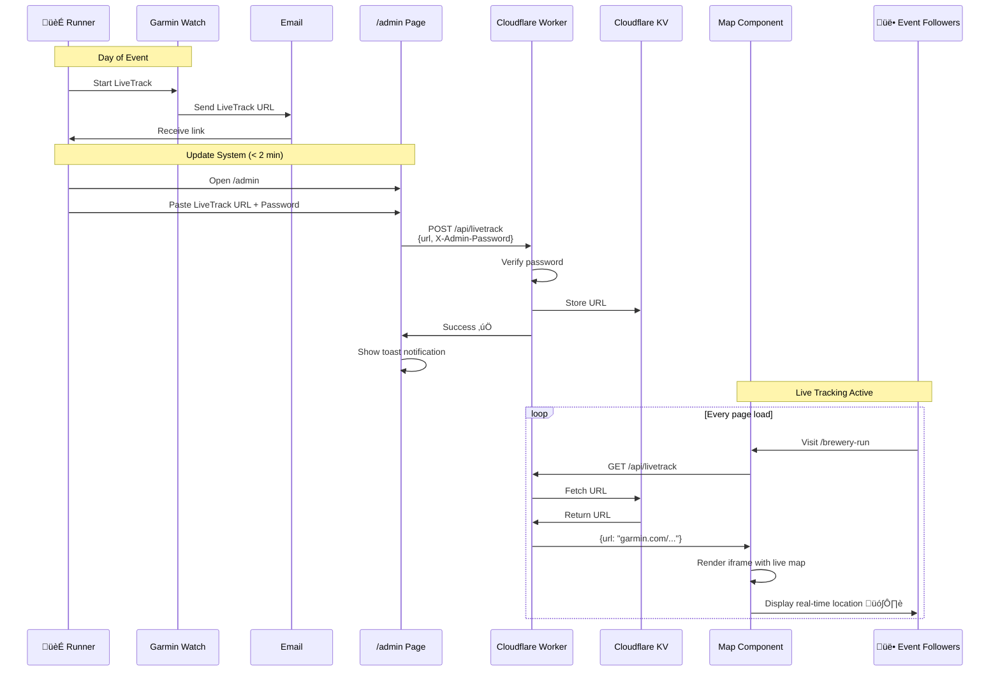

# MRC Baltic Cruise 2025 mobile program

[](https://app.netlify.com/sites/mrcbalticcruise/deploys)
[](https://github.com/Tiketti/mrc-baltic-cruise/actions/workflows/playwright.yml)

This project contains multiple MRC event sites:

- **Root (/)**: Landing page with links to all events
- **Baltic Cruise (/baltic-cruise)**: Archived 2025 Baltic Cruise site  
- **Brewery Run (/brewery-run)**: Helsinki brewery-to-brewery running event

## Brewery Run Features

The brewery run site includes:
- **Real-time timeline**: Shows current brewery location and running status
- **Smart highlighting**: Visual indicators based on current time
- **Mobile-first design**: Optimized for use during the event
- **Brand-consistent styling**: Uses Mikkeller design language

### Testing Time-Based Highlighting

Use the `mockTime` query parameter to test the time-based highlighting:

```
/brewery-run?mockTime=12:30  # At Masis Brewery
/brewery-run?mockTime=13:00  # Running to Solmu  
/brewery-run?mockTime=13:45  # At Solmu Brewery
/brewery-run?mockTime=14:15  # Running to Salamanation
```

Format: `HH:MM` (24-hour format, no seconds needed)

### Live Track System Architecture

The brewery run includes a dynamic live tracking system powered by Cloudflare Workers and KV storage:



**Key Components:**

- **Admin Dashboard** (`/admin`): Mobile-friendly interface for updating the LiveTrack URL on-the-fly
- **Cloudflare Worker**: Serverless API endpoint that handles GET/POST requests
- **Cloudflare KV**: Persistent key-value storage for the LiveTrack URL
- **Map Component**: Fetches URL from Worker and displays live tracking iframe
- **Security**: Password-protected POST endpoint (via `X-Admin-Password` header)

**Workflow:**
1. Runner starts Garmin LiveTrack and receives email with unique session URL
2. Runner opens `/admin` on phone, pastes URL, enters password
3. Worker validates password and stores URL in KV
4. All users visiting the map tab automatically see live tracking
5. No backend, no database, no complex infrastructure needed!

## Temporarily Hidden Features

For the focused brewery run launch, the following features are commented out but easily restorable:

- **Navigation component** (in `App.tsx`)
- **Map tab functionality** (in `BreweryRun.tsx`)
- **Tab switching UI** (in `BreweryRun.tsx`)

To restore: uncomment the relevant sections and add back the `useState` import.


